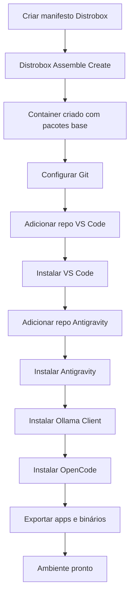

# Role: Dev Environment

Esta role configura um ambiente de desenvolvimento completo usando Distrobox com ferramentas modernas de desenvolvimento.

## Descrição

A role `dev_env` cria um container Distrobox baseado no openSUSE Tumbleweed com um ambiente de desenvolvimento completo, incluindo VS Code, Git, Antigravity, Ollama, OpenCode e ferramentas de compilação.

## Requisitos

- Distrobox instalado e configurado
- Podman ou Docker
- Acesso à internet para baixar pacotes e ferramentas
- Permissões de superusuário para instalação de pacotes no container

## Variáveis

Definidas em `defaults/main.yml`:

```yaml
dev_box_name: "dev-fedora"

dev_packages:
  - curl
  - python3-pip
  - git
  - gcc
  - gcc-c++
  - python3-devel
  - make
  - tar
  - wget
  - which
  - gawk
  - zstd

git_user_name: ""      # Opcional: seu nome para commits Git
git_user_email: ""     # Opcional: seu email para commits Git
```

### Variáveis Globais Necessárias

Definidas em `group_vars/all.yml`:

```yaml
tumbleweed_image: "tumbleweed:latest"  # Imagem do openSUSE Tumbleweed
```

## Estrutura

```
roles/dev_env/
├── defaults/
│   └── main.yml              # Variáveis padrão
├── tasks/
│   ├── main.yml              # Ponto de entrada
│   ├── common_configs.yml    # Configurações comuns
│   ├── fedora.yml            # Tarefas específicas do Fedora
│   ├── opensuse_tumbleweed.yml
│   └── opensuse_microos.yml
├── templates/
│   └── distrobox.ini.j2      # Template do manifesto Distrobox
└── README.md                 # Esta documentação
```

## Funcionamento

### 1. Criação do Container via Distrobox Assemble

A role usa o **Distrobox Assemble** para criar e configurar o container de forma declarativa:

```ini
[dev-fedora]
image=tumbleweed:latest
additional_packages="curl python3-pip git gcc gcc-c++ python3-devel make tar wget which gawk zstd"
pull=true
replace=false
EOL=false
```

**Vantagens do Distrobox Assemble:**
- ✅ Declarativo e reproduzível
- ✅ Instala pacotes automaticamente na criação
- ✅ Idempotente (não recria se já existe)
- ✅ Fácil de versionar e compartilhar

### 2. Ferramentas Instaladas

#### a) **Pacotes Base** (via Distrobox Assemble)
- **curl, wget**: Download de arquivos
- **git**: Controle de versão
- **gcc, gcc-c++**: Compiladores C/C++
- **python3-pip, python3-devel**: Python e desenvolvimento
- **make, tar, gawk, zstd**: Ferramentas de build
- **which**: Localização de comandos

#### b) **Visual Studio Code**
```bash
# Adiciona repositório oficial da Microsoft
sudo rpm --import https://packages.microsoft.com/keys/microsoft.asc
sudo dnf install -y code

# Exporta para o menu do sistema host
distrobox-export --app code
```

**Recursos:**
- Editor completo com extensões
- Integração com Git
- Terminal integrado
- Debugging

#### c) **Git** (Configuração)
```bash
# Configuração global
git config --global core.editor "code --wait"
git config --global user.name "Seu Nome"
git config --global user.email "seu@email.com"

# Exporta para o host
distrobox-export --bin /usr/bin/git --export-path ~/.local/bin
```

#### d) **Antigravity**
```bash
# Adiciona repositório
sudo tee /etc/yum.repos.d/antigravity.repo << EOL
[antigravity-rpm]
name=Antigravity RPM Repository
baseurl=https://us-central1-yum.pkg.dev/projects/antigravity-auto-updater-dev/antigravity-rpm
enabled=1
gpgcheck=0
EOL

# Instala
sudo dnf install -y antigravity

# Exporta para o menu do sistema
distrobox-export --app antigravity
```

#### e) **Ollama Client**
```bash
# Instala apenas o cliente (sem serviço)
export OLLAMA_SKIP_SERVICE_INSTALL=1
curl -fsSL https://ollama.com/install.sh | sh

# Exporta para o host
distrobox-export --bin /usr/local/bin/ollama --export-path ~/.local/bin
```

**Uso:**
```bash
# Conectar a um servidor Ollama remoto ou local
ollama run llama2
ollama list
```

#### f) **OpenCode**
```bash
# Instala OpenCode
curl -fsSL https://opencode.ai/install | bash

# Exporta para o host
distrobox-export --bin ~/.opencode/bin/opencode --export-path ~/.local/bin
```

### 3. Exportações para o Host

A role exporta automaticamente:

| Ferramenta | Tipo | Localização Host |
|------------|------|------------------|
| **code** | App | Menu de aplicativos |
| **antigravity** | App | Menu de aplicativos |
| **git** | Binário | `~/.local/bin/git` |
| **ollama** | Binário | `~/.local/bin/ollama` |
| **opencode** | Binário | `~/.local/bin/opencode` |

**Como funciona:**
- Apps aparecem no menu do sistema como se fossem nativos
- Binários em `~/.local/bin` ficam disponíveis no PATH
- Executam dentro do container mas parecem nativos

### 4. Fluxo de Instalação



## Uso

### Executar a Role

```bash
# Executar apenas dev_env
ansible-playbook -i inventory.yml site.yml --tags dev_env

# Com configuração de Git
ansible-playbook -i inventory.yml site.yml --tags dev_env \
  -e "git_user_name='Seu Nome'" \
  -e "git_user_email='seu@email.com'"
```

### Acessar o Container

```bash
# Entrar no container
distrobox enter dev-fedora

# Verificar ferramentas instaladas
which code git gcc python3 ollama opencode

# Verificar versões
code --version
git --version
python3 --version
ollama --version
```

### Usar Ferramentas Exportadas

```bash
# No host, as ferramentas funcionam normalmente
git clone https://github.com/user/repo.git
code .
ollama run llama2
opencode
```

### Desenvolver no Container

```bash
# Entrar no container
distrobox enter dev-fedora

# Criar projeto Python
mkdir ~/projetos/meu-app
cd ~/projetos/meu-app
python3 -m venv venv
source venv/bin/activate
pip install flask

# Abrir no VS Code (do host)
code ~/projetos/meu-app
```

### Gerenciar o Container

```bash
# Listar containers
distrobox list

# Status do container
podman ps -a | grep dev-fedora

# Parar container
distrobox stop dev-fedora

# Iniciar container
distrobox enter dev-fedora -- true

# Remover container
distrobox rm dev-fedora
```

## Personalização

### Adicionar Mais Pacotes

Edite `roles/dev_env/defaults/main.yml`:

```yaml
dev_packages:
  - curl
  - python3-pip
  - git
  # Adicione seus pacotes aqui
  - nodejs
  - npm
  - docker
  - kubectl
```

### Configurar Git Automaticamente

No `inventory.yml` ou `group_vars/all.yml`:

```yaml
git_user_name: "Seu Nome"
git_user_email: "seu@email.com"
```

### Adicionar Mais Ferramentas

Edite `roles/dev_env/tasks/common_configs.yml` e adicione novas tarefas:

```yaml
- name: Instalar Node.js
  command: "distrobox enter {{ dev_box_name }} -- sudo dnf install -y nodejs npm"
  register: nodejs_install
  changed_when: "'Installing' in nodejs_install.stdout"

- name: Exportar Node.js
  command: "distrobox enter {{ dev_box_name }} -- distrobox-export --bin /usr/bin/node --export-path ~/.local/bin"
```

## Troubleshooting

### Problema: Container não é criado

**Sintoma:**
```
Error: container dev-fedora already exists
```

**Solução:**
```bash
# Verificar se existe
distrobox list

# Remover e recriar
distrobox rm dev-fedora
ansible-playbook -i inventory.yml site.yml --tags dev_env
```

### Problema: VS Code não abre

**Sintoma:**
```
code: command not found
```

**Diagnóstico:**
```bash
# Verificar se está instalado no container
distrobox enter dev-fedora -- which code

# Verificar exportação
ls -la ~/.local/share/applications/ | grep code
```

**Solução:**
```bash
# Re-exportar manualmente
distrobox enter dev-fedora -- distrobox-export --app code

# Ou reinstalar
distrobox enter dev-fedora -- sudo dnf reinstall -y code
```

### Problema: Git não está configurado

**Sintoma:**
```
*** Please tell me who you are.
```

**Solução:**
```bash
# Configurar manualmente
distrobox enter dev-fedora -- git config --global user.name "Seu Nome"
distrobox enter dev-fedora -- git config --global user.email "seu@email.com"

# Ou re-executar a role com variáveis
ansible-playbook -i inventory.yml site.yml --tags dev_env \
  -e "git_user_name='Seu Nome'" \
  -e "git_user_email='seu@email.com'"
```

### Problema: Ollama não conecta

**Sintoma:**
```
Error: could not connect to ollama server
```

**Solução:**
```bash
# Verificar se o servidor Ollama está rodando
systemctl status ollama  # Se instalado como serviço

# Ou iniciar servidor manualmente
ollama serve &

# Conectar a servidor remoto
export OLLAMA_HOST=http://servidor:11434
ollama list
```

### Problema: OpenCode não funciona

**Sintoma:**
```
opencode: command not found
```

**Diagnóstico:**
```bash
# Verificar instalação
distrobox enter dev-fedora -- ls -la ~/.opencode/bin/

# Verificar PATH
echo $PATH | grep .local/bin
```

**Solução:**
```bash
# Re-exportar
distrobox enter dev-fedora -- distrobox-export --bin ~/.opencode/bin/opencode --export-path ~/.local/bin

# Adicionar ao PATH se necessário
echo 'export PATH="$HOME/.local/bin:$PATH"' >> ~/.bashrc
source ~/.bashrc
```

### Problema: Pacotes não são instalados

**Sintoma:**
```
Error: Unable to find a match: <pacote>
```

**Causa:**
O container usa openSUSE Tumbleweed, que usa `zypper`, mas algumas tarefas usam `dnf`.

**Solução:**
Verifique se o pacote existe no Tumbleweed:
```bash
distrobox enter dev-fedora -- zypper search <pacote>
```

## Integração com IDEs

### VS Code

O VS Code instalado no container tem acesso total aos arquivos do host:

```bash
# Abrir projeto do host
code ~/projetos/meu-app

# Abrir arquivo específico
code ~/documentos/arquivo.txt

# Abrir com extensões
code --install-extension ms-python.python
```

### Antigravity

Ferramenta de desenvolvimento com IA:

```bash
# Abrir do menu de aplicativos
# Ou via linha de comando
antigravity
```

## Boas Práticas

### 1. Organização de Projetos

```
~/projetos/
├── python/
│   ├── projeto1/
│   └── projeto2/
├── nodejs/
│   └── app-web/
└── rust/
    └── cli-tool/
```

### 2. Uso de Ambientes Virtuais

```bash
# Python
python3 -m venv venv
source venv/bin/activate

# Node.js
npm init
npm install
```

### 3. Backup de Configurações

```bash
# Exportar configurações do VS Code
code --list-extensions > extensions.txt

# Backup de dotfiles
cp ~/.gitconfig ~/backup/
cp ~/.config/Code/User/settings.json ~/backup/
```

### 4. Atualização Regular

```bash
# Atualizar pacotes no container
distrobox enter dev-fedora -- sudo zypper dup -y

# Atualizar VS Code
distrobox enter dev-fedora -- sudo dnf update -y code

# Atualizar Ollama
distrobox enter dev-fedora -- curl -fsSL https://ollama.com/install.sh | sh
```

## Recursos Adicionais

### Extensões Recomendadas do VS Code

```bash
# Python
code --install-extension ms-python.python
code --install-extension ms-python.vscode-pylance

# Git
code --install-extension eamodio.gitlens

# Docker
code --install-extension ms-azuretools.vscode-docker

# Markdown
code --install-extension yzhang.markdown-all-in-one
```

### Aliases Úteis

Adicione ao `~/.bashrc` ou `~/.zshrc`:

```bash
# Atalhos para o container dev
alias dev='distrobox enter dev-fedora'
alias dev-code='distrobox enter dev-fedora -- code'
alias dev-update='distrobox enter dev-fedora -- sudo zypper dup -y'
```

## Comparação: Antes vs. Depois

| Aspecto | Desenvolvimento Tradicional | Com dev_env Role |
|---------|----------------------------|------------------|
| **Instalação** | Manual, demorada | Automatizada via Ansible |
| **Isolamento** | Pacotes no sistema host | Container isolado |
| **Reprodutibilidade** | Difícil de replicar | Manifesto versionado |
| **Limpeza** | Deixa resíduos no sistema | Remove container = limpo |
| **Múltiplos ambientes** | Conflitos de versões | Containers separados |
| **Portabilidade** | Dependente do sistema | Funciona em qualquer distro |

## Notas Importantes

1. **Container Rootless:** O container roda como seu usuário, não como root.

2. **Acesso a Arquivos:** O container tem acesso total ao seu `$HOME`.

3. **Rede:** O container compartilha a rede do host.

4. **Performance:** Praticamente nativa, sem overhead de VM.

5. **Persistência:** Dados no container persistem entre reinicializações.

6. **Atualizações:** Pacotes no container são independentes do host.

## Suporte

Para problemas ou dúvidas:
1. Verifique os logs: `journalctl --user -u distrobox@dev-fedora`
2. Consulte a seção de Troubleshooting acima
3. Documentação do Distrobox: https://distrobox.privatedns.org/
4. Abra uma issue no repositório do projeto

## Licença

Este código é fornecido como está, sem garantias. Use por sua conta e risco.