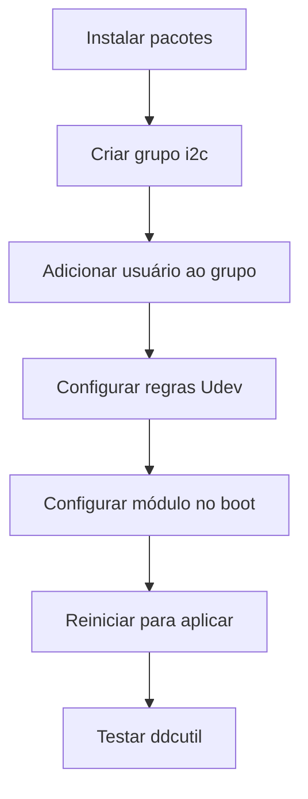

# Role: Host Configuration

Esta role configura o sistema host com ferramentas essenciais e otimizações, incluindo controle de brilho de monitor via DDC/CI.

## Descrição

A role `host_config` instala e configura ferramentas no sistema host (não em containers), com foco em:
- Controle de brilho de monitores externos via DDC/CI (I2C)
- Shell ZSH
- Ferramentas de sistema essenciais

## Requisitos

- Acesso root (usa `become: true`)
- Monitor externo com suporte a DDC/CI (para controle de brilho)
- Placa de vídeo com suporte a I2C

## Variáveis

A role **não requer variáveis**. Ela usa automaticamente o usuário que está executando o playbook através da variável `ansible_user_id`.

```yaml
# ✅ Usa automaticamente ansible_user_id
# Nenhuma configuração necessária!
```

## Estrutura

```
roles/host_config/
├── defaults/
│   └── main.yml              # Variáveis padrão
├── tasks/
│   ├── main.yml              # Ponto de entrada
│   ├── fedora.yml            # Tarefas específicas do Fedora
│   ├── opensuse_tumbleweed.yml  # Tarefas para Tumbleweed
│   └── opensuse_microos.yml     # Tarefas para MicroOS
└── README.md                 # Esta documentação
```

## Funcionamento

### 1. Instalação de Pacotes

#### openSUSE Tumbleweed
```bash
sudo zypper install ddcutil i2c-tools zsh
```

#### openSUSE MicroOS (Transactional)
```bash
sudo transactional-update --non-interactive pkg install ddcutil i2c-tools which zsh
```

**Pacotes instalados:**
- **ddcutil**: Controle de monitores via DDC/CI
- **i2c-tools**: Ferramentas para debug de I2C
- **zsh**: Shell avançado (Z Shell)
- **which**: Localização de comandos (MicroOS)

### 2. Configuração do I2C para Controle de Brilho

#### a) Criar Grupo i2c
```bash
sudo groupadd -r i2c
```

#### b) Adicionar Usuário ao Grupo
```bash
# O Ansible adiciona automaticamente o usuário que executa o playbook
sudo usermod -aG i2c $USER
```

#### c) Configurar Regras Udev

Arquivo: `/etc/udev/rules.d/99-i2c.rules`
```
KERNEL=="i2c-[0-9]*", GROUP="i2c", MODE="0660"
```

**O que faz:**
- Dispositivos I2C (`/dev/i2c-*`) pertencem ao grupo `i2c`
- Permissões `0660` (leitura/escrita para owner e grupo)
- Permite controle sem root

#### d) Carregar Módulo no Boot

Arquivo: `/etc/modules-load.d/i2c.conf`
```
i2c-dev
```

**O que faz:**
- Carrega módulo `i2c-dev` automaticamente no boot
- Necessário para comunicação I2C

### 3. Fluxo de Configuração



## Uso

### Executar a Role

```bash
# Executar apenas host_config
ansible-playbook -i inventory.yml site.yml --tags host_config

# A role usa automaticamente o usuário que está executando o playbook
# Não é necessário especificar variáveis!
```

### Aplicar Configurações

**IMPORTANTE:** Após executar a role, é necessário:

1. **Recarregar regras Udev:**
   ```bash
   sudo udevadm control --reload-rules
   sudo udevadm trigger
   ```

2. **Carregar módulo I2C:**
   ```bash
   sudo modprobe i2c-dev
   ```

3. **Fazer logout/login** (para aplicar grupo i2c)
   ```bash
   # Ou reiniciar o sistema
   sudo reboot
   ```

### Verificar Instalação

```bash
# Verificar se o módulo está carregado
lsmod | grep i2c_dev

# Verificar dispositivos I2C
ls -la /dev/i2c-*

# Verificar grupo do usuário
groups | grep i2c

# Verificar permissões
ls -la /dev/i2c-* | head -n 1
```

## Controle de Brilho com DDCUtil

### Detectar Monitores

```bash
# Detectar monitores compatíveis
ddcutil detect

# Saída esperada:
# Display 1
#   I2C bus:  /dev/i2c-6
#   Monitor:  Dell U2720Q
#   ...
```

### Obter Brilho Atual

```bash
# Monitor principal (display 1)
ddcutil getvcp 10

# Saída:
# VCP code 0x10 (Brightness): current value = 50, max value = 100
```

### Ajustar Brilho

```bash
# Definir brilho para 50%
ddcutil setvcp 10 50

# Aumentar brilho em 10
ddcutil setvcp 10 + 10

# Diminuir brilho em 10
ddcutil setvcp 10 - 10

# Monitor específico (display 2)
ddcutil --display 2 setvcp 10 75
```

### Outros Controles

```bash
# Listar todos os recursos disponíveis
ddcutil capabilities

# Contraste (VCP code 0x12)
ddcutil setvcp 12 80

# Entrada de vídeo (VCP code 0x60)
ddcutil getvcp 60
ddcutil setvcp 60 0x0f  # HDMI 1
ddcutil setvcp 60 0x11  # DisplayPort 1

# Volume (se suportado)
ddcutil setvcp 62 50
```

## Scripts Úteis

### Script de Controle de Brilho

Crie `~/.local/bin/brightness`:

```bash
#!/bin/bash
# Controle rápido de brilho

case "$1" in
  up)
    ddcutil setvcp 10 + 10
    ;;
  down)
    ddcutil setvcp 10 - 10
    ;;
  set)
    ddcutil setvcp 10 "$2"
    ;;
  get)
    ddcutil getvcp 10
    ;;
  *)
    echo "Uso: brightness {up|down|set VALUE|get}"
    exit 1
    ;;
esac
```

```bash
# Tornar executável
chmod +x ~/.local/bin/brightness

# Usar
brightness up
brightness down
brightness set 75
brightness get
```

### Atalhos de Teclado

Configure no seu DE/WM:

```bash
# KDE Plasma
# Settings → Shortcuts → Custom Shortcuts

# GNOME
gsettings set org.gnome.settings-daemon.plugins.media-keys custom-keybindings "['/org/gnome/settings-daemon/plugins/media-keys/custom-keybindings/custom0/']"
gsettings set org.gnome.settings-daemon.plugins.media-keys.custom-keybinding:/org/gnome/settings-daemon/plugins/media-keys/custom-keybindings/custom0/ name 'Brightness Up'
gsettings set org.gnome.settings-daemon.plugins.media-keys.custom-keybinding:/org/gnome/settings-daemon/plugins/media-keys/custom-keybindings/custom0/ command 'ddcutil setvcp 10 + 10'
gsettings set org.gnome.settings-daemon.plugins.media-keys.custom-keybinding:/org/gnome/settings-daemon/plugins/media-keys/custom-keybindings/custom0/ binding '<Super>F6'
```

### Serviço Systemd para Brilho Inicial

Crie `/etc/systemd/system/monitor-brightness.service`:

```ini
[Unit]
Description=Set monitor brightness on boot
After=graphical.target

[Service]
Type=oneshot
ExecStart=/usr/bin/ddcutil setvcp 10 80
RemainAfterExit=yes

[Install]
WantedBy=graphical.target
```

```bash
# Habilitar
sudo systemctl enable monitor-brightness.service
sudo systemctl start monitor-brightness.service
```

## Troubleshooting

### Problema: ddcutil não detecta monitores

**Sintoma:**
```bash
$ ddcutil detect
No displays found
```

**Diagnóstico:**
```bash
# Verificar módulo I2C
lsmod | grep i2c_dev

# Verificar dispositivos
ls -la /dev/i2c-*

# Verificar permissões
groups | grep i2c

# Testar com root
sudo ddcutil detect
```

**Soluções:**

1. **Carregar módulo:**
   ```bash
   sudo modprobe i2c-dev
   ```

2. **Verificar grupo:**
   ```bash
   sudo usermod -aG i2c $USER
   # Fazer logout/login
   ```

3. **Recarregar Udev:**
   ```bash
   sudo udevadm control --reload-rules
   sudo udevadm trigger
   ```

4. **Verificar cabo:**
   - Use cabo DisplayPort ou HDMI de qualidade
   - Alguns cabos não suportam DDC/CI
   - Evite adaptadores/conversores

### Problema: Permissão negada

**Sintoma:**
```bash
$ ddcutil getvcp 10
Error opening /dev/i2c-6: Permission denied
```

**Solução:**
```bash
# Verificar grupo
groups | grep i2c

# Se não estiver no grupo
sudo usermod -aG i2c $USER

# Fazer logout/login ou:
newgrp i2c

# Verificar permissões do dispositivo
ls -la /dev/i2c-*
```

### Problema: Monitor não responde

**Sintoma:**
```bash
$ ddcutil setvcp 10 50
DDC communication failed
```

**Soluções:**

1. **Aumentar timeout:**
   ```bash
   ddcutil --sleep-multiplier 2 setvcp 10 50
   ```

2. **Usar bus específico:**
   ```bash
   # Detectar bus
   ddcutil detect
   
   # Usar bus diretamente
   ddcutil --bus 6 setvcp 10 50
   ```

3. **Verificar cabo e conexão:**
   - Reconectar cabo
   - Testar outra porta
   - Verificar se monitor está ligado

### Problema: Comando lento

**Sintoma:**
```
ddcutil demora muito para executar
```

**Soluções:**

1. **Usar cache:**
   ```bash
   # Primeira execução (lenta)
   ddcutil detect

   # Execuções seguintes (rápidas)
   ddcutil --bus 6 setvcp 10 50
   ```

2. **Ajustar sleep multiplier:**
   ```bash
   ddcutil --sleep-multiplier 0.5 setvcp 10 50
   ```

3. **Criar alias:**
   ```bash
   alias brightness='ddcutil --bus 6 --sleep-multiplier 0.5'
   brightness setvcp 10 50
   ```

### Problema: MicroOS não aplica mudanças

**Sintoma:**
```
Pacotes instalados mas não disponíveis
```

**Solução:**
```bash
# MicroOS requer reinicialização após transactional-update
sudo transactional-update --non-interactive pkg install ddcutil
sudo reboot
```

## Personalização

### Adicionar Mais Pacotes

Edite as tarefas específicas da distribuição:

**Tumbleweed** (`roles/host_config/tasks/opensuse_tumbleweed.yml`):
```yaml
- name: Instalar pacotes adicionais
  zypper:
    name:
      - ddcutil
      - i2c-tools
      - zsh
      # Adicione aqui
      - htop
      - neofetch
    state: present
  become: true
```

**MicroOS** (`roles/host_config/tasks/opensuse_microos.yml`):
```yaml
- name: Instalar pacotes adicionais
  command: transactional-update --non-interactive pkg install ddcutil i2c-tools zsh htop neofetch
  become: true
```

### Configurar Múltiplos Usuários

No `inventory.yml`:
```yaml
all:
  hosts:
    localhost:
      ansible_connection: local
      host_user: usuario1

  vars:
    additional_users:
      - usuario2
      - usuario3
```

Adicione tarefa em `common_configs.yml`:
```yaml
- name: Adicionar usuários adicionais ao grupo i2c
  user:
    name: "{{ item }}"
    groups: i2c
    append: yes
  loop: "{{ additional_users | default([]) }}"
  become: true
```

## Integração com Desktop Environments

### KDE Plasma

```bash
# Criar widget de brilho
# System Settings → Shortcuts → Custom Shortcuts
# Adicionar comandos ddcutil
```

### GNOME

```bash
# Extensão DDC Brightness Control
# https://extensions.gnome.org/extension/2645/brightness-control-using-ddcutil/
```

### i3/Sway

Adicione ao config:
```
bindsym XF86MonBrightnessUp exec ddcutil setvcp 10 + 10
bindsym XF86MonBrightnessDown exec ddcutil setvcp 10 - 10
```

## Boas Práticas

### 1. Backup de Configurações

```bash
# Salvar configurações atuais
ddcutil getvcp 10 > ~/monitor-brightness.txt
ddcutil capabilities > ~/monitor-capabilities.txt
```

### 2. Perfis de Brilho

```bash
# Criar perfis
echo "ddcutil setvcp 10 100" > ~/.config/brightness-day.sh
echo "ddcutil setvcp 10 30" > ~/.config/brightness-night.sh
chmod +x ~/.config/brightness-*.sh

# Usar
~/.config/brightness-day.sh
```

### 3. Automação com Cron

```bash
# Ajustar brilho automaticamente
crontab -e

# Dia (8h): brilho 100%
0 8 * * * /usr/bin/ddcutil setvcp 10 100

# Noite (20h): brilho 30%
0 20 * * * /usr/bin/ddcutil setvcp 10 30
```

## Recursos Adicionais

### Links Úteis

- **DDCUtil:** http://www.ddcutil.com/
- **DDC/CI Spec:** https://en.wikipedia.org/wiki/Display_Data_Channel
- **I2C Tools:** https://i2c.wiki.kernel.org/

### Monitores Testados

| Marca | Modelo | DDC/CI | Notas |
|-------|--------|--------|-------|
| Dell | U2720Q | ✅ | Funciona perfeitamente |
| LG | 27UK850 | ✅ | Funciona bem |
| Samsung | Odyssey G7 | ✅ | Requer sleep-multiplier 2 |
| BenQ | PD2700U | ✅ | Funciona perfeitamente |
| ASUS | PA279Q | ⚠️ | Funciona mas lento |

## Comparação: DDCUtil vs. Controles Nativos

| Aspecto | Controles do Monitor | DDCUtil |
|---------|---------------------|---------|
| **Velocidade** | Instantâneo | ~1-2 segundos |
| **Automação** | Não | Sim |
| **Atalhos** | Não | Sim |
| **Scripts** | Não | Sim |
| **Perfis** | Manual | Automatizado |
| **Múltiplos monitores** | Um por vez | Todos simultaneamente |

## Notas Importantes

1. **Compatibilidade:** Nem todos os monitores suportam DDC/CI. Verifique o manual.

2. **Performance:** Comandos DDC têm latência de ~1-2 segundos.

3. **Cabos:** Use cabos de qualidade. Alguns cabos baratos não transmitem DDC.

4. **Adaptadores:** Evite adaptadores USB-C para HDMI/DP, podem não suportar DDC.

5. **Múltiplos Monitores:** Cada monitor tem seu próprio bus I2C.

6. **MicroOS:** Requer reinicialização após instalação de pacotes.

## Suporte

Para problemas ou dúvidas:
1. Consulte a seção de Troubleshooting acima
2. Documentação do DDCUtil: http://www.ddcutil.com/
3. Manual do seu monitor
4. Fórum da sua distribuição
5. Abra uma issue no repositório do projeto

## Licença

Este código é fornecido como está, sem garantias. Use por sua conta e risco.