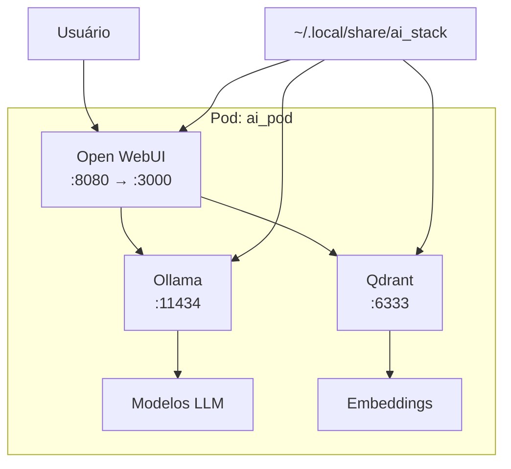

# Role: IA Containers

Esta role configura uma stack completa de IA usando **Podman Quadlets**, incluindo Ollama, Qdrant e Open WebUI em um pod compartilhado, gerenciados como serviços do usuário via systemd.

## Descrição

A role `ia_containers` cria e gerencia containers para uma stack de IA local usando **Quadlets do Podman**. Os containers são gerenciados como serviços systemd do usuário, permitindo inicialização automática, gerenciamento via `systemctl --user`, e integração completa com o sistema.

## Requisitos

- Podman 4.4+ instalado e configurado (com suporte a Quadlets)
- Ansible collection `containers.podman` instalada
- Espaço em disco suficiente para modelos (recomendado: 50GB+)
- GPU (opcional, mas recomendado para melhor performance)
- systemd com suporte a serviços de usuário

## Variáveis

Definidas em `defaults/main.yml`:

```yaml
ai_pod_name: "ai_pod"

ai_pod_ports:
  - "6333:6333"  # Qdrant (banco vetorial)
  - "3000:8080"  # Open WebUI

ai_data_dir: "{{ lookup('env', 'HOME') }}/.local/share/ai_stack"

ia_stack:
  - name: 'ollama'
    image: 'docker.io/ollama/ollama:latest'
    volumes: ["{{ ai_data_dir }}/ollama:/root/.ollama:Z"]
  
  - name: 'qdrant'
    image: 'docker.io/qdrant/qdrant:latest'
    volumes: ["{{ ai_data_dir }}/qdrant:/qdrant/storage:Z"]
  
  - name: 'open-webui'
    image: 'ghcr.io/open-webui/open-webui:main'
    env: { "OLLAMA_BASE_URL": "http://127.0.0.1:11434" }
    volumes: ["{{ ai_data_dir }}/open-webui:/app/backend/data:Z"]
```

## Estrutura

```
roles/ia_containers/
├── defaults/
│   └── main.yml              # Variáveis padrão
├── tasks/
│   ├── main.yml              # Ponto de entrada
│   ├── common_configs.yml    # Configurações comuns (Quadlets)
│   ├── fedora.yml            # Tarefas específicas do Fedora
│   ├── opensuse_tumbleweed.yml
│   └── opensuse_microos.yml
├── templates/
│   ├── ai_pod.pod.j2         # Template do Pod Quadlet
│   └── container.container.j2 # Template dos Containers Quadlet
├── handlers/
│   └── main.yml              # Handler para reload do systemd
└── README.md                 # Esta documentação
```

## O que são Quadlets?

**Quadlets** são arquivos de configuração do Podman (`.container`, `.pod`, `.network`, `.volume`) que são automaticamente convertidos em unidades systemd. Eles permitem gerenciar containers como serviços nativos do sistema.

### Vantagens dos Quadlets:

1. **Gerenciamento via systemd** - Use `systemctl --user start/stop/enable/status`
2. **Inicialização automática** - Containers iniciam com o login do usuário
3. **Logs integrados** - Acesse logs com `journalctl --user -u <serviço>`
4. **Dependências declarativas** - Defina ordem de inicialização (After/Requires)
5. **Atualizações automáticas** - Suporte a `podman auto-update`
6. **Configuração declarativa** - Formato INI simples e legível

### Localização dos Quadlets:

```
~/.config/containers/systemd/
├── ai_pod.pod              # Definição do Pod
├── ollama.container        # Container Ollama
├── qdrant.container        # Container Qdrant
└── open-webui.container    # Container Open WebUI
```

Após criar os arquivos, o Podman gera automaticamente as unidades systemd:

```
~/.config/systemd/user/
├── ai_pod.service
├── ollama.service
├── qdrant.service
└── open-webui.service
```

## Funcionamento

### 1. Arquitetura da Stack



**Componentes:**

1. **Ollama** - Servidor de modelos LLM
   - Porta interna: 11434
   - Executa modelos como Llama 2, Mistral, etc.
   - Gerencia download e cache de modelos

2. **Qdrant** - Banco de dados vetorial
   - Porta: 6333 (exposta no host)
   - Armazena embeddings para RAG
   - API REST e gRPC

3. **Open WebUI** - Interface web
   - Porta: 8080 (container) → 3000 (host)
   - Interface tipo ChatGPT
   - Suporte a múltiplos modelos
   - RAG com Qdrant

### 2. Criação do Pod

```bash
podman pod create \
  --name ai_pod \
  --publish 6333:6333 \
  --publish 3000:8080
```

**Vantagens do Pod:**
- ✅ Containers compartilham rede (localhost)
- ✅ Gerenciamento unificado
- ✅ Inicialização/parada conjunta
- ✅ Isolamento do host

### 3. Containers no Pod

#### a) Ollama
```bash
podman run -d \
  --name ollama \
  --pod ai_pod \
  --restart always \
  -v ~/.local/share/ai_stack/ollama:/root/.ollama:Z \
  docker.io/ollama/ollama:latest
```

**Recursos:**
- Executa modelos LLM localmente
- API compatível com OpenAI
- Suporte a GPU (NVIDIA, AMD)
- Cache de modelos persistente

#### b) Qdrant
```bash
podman run -d \
  --name qdrant \
  --pod ai_pod \
  --restart always \
  -v ~/.local/share/ai_stack/qdrant:/qdrant/storage:Z \
  docker.io/qdrant/qdrant:latest
```

**Recursos:**
- Banco vetorial de alta performance
- API REST e gRPC
- Suporte a filtros e metadados
- Persistência de dados

#### c) Open WebUI
```bash
podman run -d \
  --name open-webui \
  --pod ai_pod \
  --restart always \
  -e OLLAMA_BASE_URL=http://127.0.0.1:11434 \
  -v ~/.local/share/ai_stack/open-webui:/app/backend/data:Z \
  ghcr.io/open-webui/open-webui:main
```

**Recursos:**
- Interface web moderna
- Chat com múltiplos modelos
- Upload de documentos (RAG)
- Histórico de conversas
- Compartilhamento de chats

### 4. Persistência de Dados

```
~/.local/share/ai_stack/
├── ollama/
│   └── models/          # Modelos baixados (vários GB)
├── qdrant/
│   └── storage/         # Banco de dados vetorial
└── open-webui/
    └── backend/data/    # Configurações e histórico
```

**Label SELinux `:Z`:**
- Permite acesso do container aos volumes
- Necessário em sistemas com SELinux (Fedora, RHEL)
- Não afeta sistemas sem SELinux

## Uso

### Executar a Role

```bash
# Executar apenas ia_containers
ansible-playbook -i inventory.yml site.yml --tags ia_containers
```

### Acessar os Serviços

#### Open WebUI (Interface Principal)
```
http://localhost:3000
```

**Primeiro acesso:**
1. Criar conta (local, não requer internet)
2. Selecionar modelo Ollama
3. Começar a conversar

#### Qdrant (API)
```
http://localhost:6333
http://localhost:6333/dashboard  # Dashboard web
```

#### Ollama (API)
```bash
# Dentro do pod (localhost)
curl http://127.0.0.1:11434/api/tags

# Do host (não exposto por padrão)
podman exec -it ollama ollama list
```

### Gerenciar os Serviços (Quadlets)

Com Quadlets, você gerencia os containers como serviços systemd do usuário:

```bash
# Listar serviços da stack de IA
systemctl --user list-units 'ai_pod*' 'ollama*' 'qdrant*' 'open-webui*'

# Status dos serviços
systemctl --user status ai_pod.service
systemctl --user status ollama.service
systemctl --user status qdrant.service
systemctl --user status open-webui.service

# Iniciar serviços
systemctl --user start ai_pod.service
systemctl --user start ollama.service

# Parar serviços
systemctl --user stop ollama.service
systemctl --user stop ai_pod.service

# Reiniciar serviços
systemctl --user restart open-webui.service

# Habilitar inicialização automática
systemctl --user enable ai_pod.service
systemctl --user enable ollama.service
systemctl --user enable qdrant.service
systemctl --user enable open-webui.service

# Desabilitar inicialização automática
systemctl --user disable ollama.service

# Ver logs em tempo real
journalctl --user -u ollama.service -f
journalctl --user -u qdrant.service -f
journalctl --user -u open-webui.service -f

# Ver logs das últimas 50 linhas
journalctl --user -u ai_pod.service -n 50

# Ver logs desde hoje
journalctl --user -u ollama.service --since today
```

### Comandos Podman Tradicionais (ainda funcionam)

```bash
# Status do pod e containers
podman pod ps
podman ps --pod

# Logs diretos
podman logs ollama
podman logs qdrant
podman logs open-webui
```

**Nota:** Com Quadlets, prefira usar `systemctl --user` e `journalctl --user` para melhor integração com o sistema.

### Gerenciar Modelos Ollama

```bash
# Entrar no container Ollama
podman exec -it ollama bash

# Listar modelos instalados
ollama list

# Baixar modelo
ollama pull llama2
ollama pull mistral
ollama pull codellama

# Executar modelo (teste)
ollama run llama2

# Remover modelo
ollama rm llama2

# Ver informações do modelo
ollama show llama2
```

### Modelos Recomendados

| Modelo | Tamanho | RAM | Uso |
|--------|---------|-----|-----|
| **llama2:7b** | 3.8GB | 8GB | Uso geral, rápido |
| **mistral:7b** | 4.1GB | 8GB | Melhor qualidade |
| **codellama:7b** | 3.8GB | 8GB | Programação |
| **llama2:13b** | 7.3GB | 16GB | Melhor qualidade |
| **mixtral:8x7b** | 26GB | 32GB | Muito bom, pesado |

```bash
# Baixar modelos recomendados
podman exec -it ollama ollama pull llama2
podman exec -it ollama ollama pull mistral
podman exec -it ollama ollama pull codellama
```

## Personalização

### Adicionar Mais Containers

Edite `roles/ia_containers/defaults/main.yml`:

```yaml
ia_stack:
  - name: 'ollama'
    image: 'docker.io/ollama/ollama:latest'
    volumes: ["{{ ai_data_dir }}/ollama:/root/.ollama:Z"]
  
  - name: 'qdrant'
    image: 'docker.io/qdrant/qdrant:latest'
    volumes: ["{{ ai_data_dir }}/qdrant:/qdrant/storage:Z"]
  
  - name: 'open-webui'
    image: 'ghcr.io/open-webui/open-webui:main'
    env: { "OLLAMA_BASE_URL": "http://127.0.0.1:11434" }
    volumes: ["{{ ai_data_dir }}/open-webui:/app/backend/data:Z"]
  
  # Adicione mais containers aqui
  - name: 'redis'
    image: 'docker.io/redis:alpine'
    volumes: ["{{ ai_data_dir }}/redis:/data:Z"]
```

### Expor Ollama no Host

Se você quiser acessar Ollama diretamente do host:

```yaml
ai_pod_ports:
  - "6333:6333"
  - "3000:8080"
  - "11434:11434"  # Adicione esta linha
```

### Usar GPU NVIDIA

Edite `roles/ia_containers/tasks/common_configs.yml`:

```yaml
- name: Subir Ollama com GPU
  containers.podman.podman_container:
    name: ollama
    image: docker.io/ollama/ollama:latest
    pod: "{{ ai_pod_name }}"
    restart_policy: always
    volumes: ["{{ ai_data_dir }}/ollama:/root/.ollama:Z"]
    device:
      - /dev/nvidia0
      - /dev/nvidiactl
      - /dev/nvidia-uvm
    state: started
```

### Mudar Diretório de Dados

```bash
ansible-playbook -i inventory.yml site.yml --tags ia_containers \
  -e "ai_data_dir=/mnt/storage/ai_stack"

## Gerenciamento com Quadlets vs Podman Direto

| Aspecto | Quadlets (Novo) | Podman Direto (Antigo) |
|---------|-----------------|------------------------|
| **Iniciar** | `systemctl --user start ollama.service` | `podman start ollama` |
| **Parar** | `systemctl --user stop ollama.service` | `podman stop ollama` |
| **Status** | `systemctl --user status ollama.service` | `podman ps` |
| **Logs** | `journalctl --user -u ollama.service -f` | `podman logs -f ollama` |
| **Auto-start** | `systemctl --user enable ollama.service` | Scripts personalizados |
| **Dependências** | Declarativas (After/Requires) | Manuais |
| **Integração** | Nativa com systemd | Separada |
| **Configuração** | Arquivos .container/.pod | Linha de comando |

```

## Troubleshooting

### Problema: Serviços não iniciam

**Sintoma:**
```bash
$ systemctl --user status ollama.service
# Estado: failed ou inactive
```

**Diagnóstico:**
```bash
# Ver logs do serviço
journalctl --user -u ollama.service -n 50

# Ver status detalhado
systemctl --user status ollama.service -l

# Verificar arquivos Quadlet
ls -la ~/.config/containers/systemd/

# Verificar se systemd gerou as unidades
systemctl --user list-unit-files | grep -E '(ai_pod|ollama|qdrant|open-webui)'
```

**Soluções:**

1. **Recarregar daemon do systemd:**
   ```bash
   systemctl --user daemon-reload
   ```

2. **Verificar permissões dos diretórios:**
   ```bash
   ls -la ~/.local/share/ai_stack/
   chmod -R 755 ~/.local/share/ai_stack/
   ```

3. **Recriar Quadlets:**
   ```bash
   # Parar serviços
   systemctl --user stop ollama.service qdrant.service open-webui.service ai_pod.service
   
   # Re-executar role
   ansible-playbook -i inventory.yml site.yml --tags ia_containers
   ```

4. **Verificar dependências:**
   ```bash
   # Certifique-se que o pod está rodando antes dos containers
   systemctl --user start ai_pod.service
   systemctl --user start ollama.service
   ```

### Problema: Open WebUI não conecta ao Ollama

**Sintoma:**
```
Connection refused ao tentar usar modelo
```

**Diagnóstico:**
```bash
# Verificar se Ollama está rodando
podman exec -it ollama ollama list

# Testar API do Ollama
podman exec -it open-webui curl http://127.0.0.1:11434/api/tags
```

**Soluções:**

1. **Verificar variável de ambiente:**
   ```bash
   podman inspect open-webui | grep OLLAMA_BASE_URL
   # Deve ser: http://127.0.0.1:11434
   ```

2. **Recriar Open WebUI:**
   ```bash
   podman stop open-webui
   podman rm open-webui
   # Re-executar role
   ```

### Problema: Modelo demora muito para responder

**Sintoma:**
```
Respostas muito lentas ou timeout
```

**Soluções:**

1. **Usar modelo menor:**
   ```bash
   # Trocar de llama2:13b para llama2:7b
   podman exec -it ollama ollama pull llama2:7b
   ```

2. **Verificar recursos:**
   ```bash
   # CPU e memória
   podman stats

   # Espaço em disco
   df -h ~/.local/share/ai_stack/
   ```

3. **Limitar contexto:**
   - No Open WebUI, reduza o tamanho do contexto
   - Settings → Advanced → Context Length: 2048

### Problema: Sem espaço em disco

**Sintoma:**
```
Error: no space left on device
```

**Soluções:**

1. **Remover modelos não usados:**
   ```bash
   podman exec -it ollama ollama list
   podman exec -it ollama ollama rm <modelo>
   ```

2. **Limpar cache do Podman:**
   ```bash
   podman system prune -a
   ```

3. **Mover dados para outro disco:**
   ```bash
   # Parar pod
   podman pod stop ai_pod
   
   # Mover dados
   mv ~/.local/share/ai_stack /mnt/storage/
   ln -s /mnt/storage/ai_stack ~/.local/share/ai_stack
   
   # Iniciar pod
   podman pod start ai_pod
   ```

### Problema: Qdrant não persiste dados

**Sintoma:**
```
Dados perdidos após reiniciar container
```

**Solução:**
```bash
# Verificar volume
podman inspect qdrant | grep -A 5 Mounts

# Verificar permissões
ls -la ~/.local/share/ai_stack/qdrant/

# Recriar com volume correto
podman stop qdrant
podman rm qdrant
ansible-playbook -i inventory.yml site.yml --tags ia_containers
```

## Casos de Uso

### 1. Chat com Documentos (RAG)

```bash
# 1. Acessar Open WebUI
http://localhost:3000

# 2. Upload de documento
# Clique em "+" → "Upload Document"

# 3. Fazer perguntas sobre o documento
"Resuma este documento"
"Quais são os pontos principais?"
```

### 2. Assistente de Código

```bash
# Usar modelo CodeLlama
podman exec -it ollama ollama pull codellama

# No Open WebUI, selecionar codellama
# Fazer perguntas de programação
```

### 3. API para Aplicações

```python
# exemplo.py
import requests

def chat(prompt):
    response = requests.post(
        'http://localhost:11434/api/generate',
        json={
            'model': 'llama2',
            'prompt': prompt,
            'stream': False
        }
    )
    return response.json()['response']

print(chat("Olá, como você está?"))
```

### 4. Busca Semântica com Qdrant

```python
# busca_vetorial.py
from qdrant_client import QdrantClient

client = QdrantClient(host="localhost", port=6333)

# Criar coleção
client.create_collection(
    collection_name="documentos",
    vectors_config={"size": 384, "distance": "Cosine"}
)

# Adicionar vetores
# Buscar similares
```

## Integração com Outras Ferramentas

### VS Code

```json
// settings.json
{
  "ollama.api.endpoint": "http://localhost:11434",
  "ollama.model": "codellama"
}
```

### Continue.dev

```json
// config.json
{
  "models": [{
    "title": "Ollama",
    "provider": "ollama",
    "model": "codellama",
    "apiBase": "http://localhost:11434"
  }]
}
```

### LangChain

```python
from langchain.llms import Ollama

llm = Ollama(
    base_url="http://localhost:11434",
    model="llama2"
)

response = llm("Explique IA em termos simples")
print(response)
```

## Boas Práticas

### 1. Backup de Dados

```bash
# Backup completo
tar -czf ai_stack_backup_$(date +%Y%m%d).tar.gz \
  ~/.local/share/ai_stack/

# Backup apenas configurações (sem modelos)
tar -czf ai_config_backup_$(date +%Y%m%d).tar.gz \
  --exclude='*.bin' \
  --exclude='models' \
  ~/.local/share/ai_stack/
```

### 2. Atualização Regular

```bash
# Atualizar imagens
podman pull docker.io/ollama/ollama:latest
podman pull docker.io/qdrant/qdrant:latest
podman pull ghcr.io/open-webui/open-webui:main

# Recriar containers
podman pod rm -f ai_pod
ansible-playbook -i inventory.yml site.yml --tags ia_containers
```

### 3. Monitoramento

```bash
# Recursos em tempo real
podman stats

# Logs contínuos
podman logs -f ollama

# Espaço usado
du -sh ~/.local/share/ai_stack/*
```

### 4. Segurança

```bash
# Não expor portas desnecessárias
# Usar apenas localhost

# Firewall (se necessário)
sudo firewall-cmd --add-port=3000/tcp --permanent
sudo firewall-cmd --reload
```

## Recursos Adicionais

### Links Úteis

- **Ollama:** https://ollama.ai/
- **Qdrant:** https://qdrant.tech/
- **Open WebUI:** https://github.com/open-webui/open-webui
- **Modelos:** https://ollama.ai/library

### Comunidades

- **r/LocalLLaMA:** Reddit
- **Ollama Discord:** https://discord.gg/ollama
- **Open WebUI Discord:** https://discord.gg/open-webui

## Comparação: Local vs. Cloud

| Aspecto | IA Local (Esta Stack) | IA Cloud (ChatGPT, etc.) |
|---------|----------------------|--------------------------|
| **Privacidade** | ✅ Total | ❌ Dados enviados |
| **Custo** | ✅ Grátis (após setup) | 💰 Assinatura mensal |
| **Internet** | ✅ Funciona offline | ❌ Requer conexão |
| **Performance** | ⚠️ Depende do hardware | ✅ Sempre rápido |
| **Modelos** | ⚠️ Limitado ao hardware | ✅ Modelos maiores |
| **Personalização** | ✅ Total controle | ❌ Limitado |

## Notas Importantes

1. **Hardware:** Modelos maiores requerem mais RAM e GPU.

2. **Espaço:** Cada modelo ocupa 3-26GB. Planeje espaço adequado.

3. **Performance:** GPU melhora significativamente a velocidade.

4. **Privacidade:** Tudo roda localmente, nenhum dado sai da máquina.

5. **Atualizações:** Modelos e containers são atualizados frequentemente.

6. **Experimentação:** Teste diferentes modelos para encontrar o melhor para seu uso.

## Suporte

Para problemas ou dúvidas:
1. Consulte a seção de Troubleshooting acima
2. Documentação do Ollama: https://ollama.ai/
3. Documentação do Qdrant: https://qdrant.tech/documentation/
4. GitHub do Open WebUI: https://github.com/open-webui/open-webui
5. Abra uma issue no repositório do projeto

## Licença

Este código é fornecido como está, sem garantias. Use por sua conta e risco.