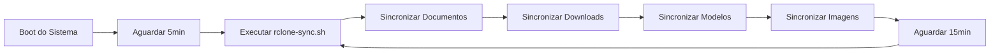

# Role: Rclone

Esta role configura o Rclone para sincronização bidirecional automática de pastas com serviços de nuvem (Google Drive, OneDrive, etc.).

## Descrição

A role `rclone` instala e configura o Rclone com sincronização bidirecional (bisync) automática via systemd timer, permitindo manter pastas locais sincronizadas com a nuvem sem intervenção manual.

## Requisitos

- Acesso à internet para download do Rclone
- Conta em serviço de nuvem (Google Drive, OneDrive, Dropbox, etc.)
- Espaço suficiente no disco local e na nuvem

## Variáveis

Definidas em `defaults/main.yml`:

```yaml
rclone_bin_dir: "{{ lookup('env', 'HOME') }}/.local/bin"
rclone_config_dir: "{{ lookup('env', 'HOME') }}/.config/rclone"

rclone_remote_name: "gdrive"  # Nome do remote configurado

rclone_sync_folders:
  - Documentos
  - Downloads
  - Modelos
  - Imagens
```

## Estrutura

```
roles/rclone/
├── defaults/
│   └── main.yml              # Variáveis padrão
├── tasks/
│   ├── main.yml              # Ponto de entrada
│   ├── common_configs.yml    # Configurações comuns
│   ├── fedora.yml            # Tarefas específicas do Fedora
│   ├── opensuse_tumbleweed.yml
│   └── opensuse_microos.yml
└── README.md                 # Esta documentação
```

## Funcionamento

### 1. Instalação do Rclone

```bash
# Download da versão mais recente
curl -L https://downloads.rclone.org/rclone-current-linux-amd64.zip -o /tmp/rclone.zip

# Extração para ~/.local/bin
unzip -j /tmp/rclone.zip 'rclone-*-linux-amd64/rclone' -d ~/.local/bin

# Permissões de execução
chmod +x ~/.local/bin/rclone
```

**Vantagens:**
- ✅ Instalação local (não requer root)
- ✅ Sempre a versão mais recente
- ✅ Independente do gerenciador de pacotes
- ✅ Fácil de atualizar

### 2. Script de Sincronização

Arquivo: `~/.local/bin/rclone-sync.sh`

```bash
#!/bin/bash
# Script gerado via Ansible

# Sincronização bidirecional de cada pasta
rclone bisync ~/Documentos gdrive:Documentos --conflict-resolve newer --verbose
rclone bisync ~/Downloads gdrive:Downloads --conflict-resolve newer --verbose
rclone bisync ~/Modelos gdrive:Modelos --conflict-resolve newer --verbose
rclone bisync ~/Imagens gdrive:Imagens --conflict-resolve newer --verbose
```

**Comando `bisync`:**
- Sincronização **bidirecional** (local ↔ nuvem)
- `--conflict-resolve newer`: Em conflitos, mantém arquivo mais recente
- `--verbose`: Logs detalhados

### 3. Serviço Systemd (User-level)

#### a) Service Unit

Arquivo: `~/.config/systemd/user/rclone-bisync.service`

```ini
[Unit]
Description=Sincronizacao Bidirecional Rclone

[Service]
Type=oneshot
ExecStart=/home/usuario/.local/bin/rclone-sync.sh
```

**Características:**
- `Type=oneshot`: Executa uma vez e termina
- Roda como seu usuário (não root)
- Logs via journalctl

#### b) Timer Unit

Arquivo: `~/.config/systemd/user/rclone-bisync.timer`

```ini
[Unit]
Description=Timer para rclone bisync

[Timer]
OnBootSec=5min          # 5 minutos após boot
OnUnitActiveSec=15min   # A cada 15 minutos após última execução

[Install]
WantedBy=timers.target
```

**Funcionamento:**
- Primeira sincronização: 5 minutos após boot
- Sincronizações seguintes: a cada 15 minutos
- Automático, não requer intervenção

### 4. Fluxo de Sincronização



## Uso

### Executar a Role

```bash
# Executar apenas rclone
ansible-playbook -i inventory.yml site.yml --tags rclone
```

### Configurar Remote (IMPORTANTE!)

**A role NÃO configura o remote automaticamente.** Você deve configurar manualmente:

```bash
# Configurar remote do Google Drive
rclone config

# Seguir o assistente:
# n) New remote
# name> gdrive
# Storage> drive (Google Drive)
# client_id> (Enter para padrão)
# client_secret> (Enter para padrão)
# scope> 1 (Full access)
# root_folder_id> (Enter)
# service_account_file> (Enter)
# Edit advanced config? n
# Use auto config? y (abrirá navegador)
# Configure this as a team drive? n
# y) Yes this is OK
# q) Quit config
```

**Outros serviços populares:**

```bash
# OneDrive
rclone config
# Storage> onedrive

# Dropbox
rclone config
# Storage> dropbox

# Amazon S3
rclone config
# Storage> s3
```

### Verificar Configuração

```bash
# Listar remotes configurados
rclone listremotes

# Testar conexão
rclone lsd gdrive:

# Listar arquivos
rclone ls gdrive:Documentos
```

### Gerenciar o Timer

```bash
# Status do timer
systemctl --user status rclone-bisync.timer

# Ver próxima execução
systemctl --user list-timers rclone-bisync.timer

# Parar timer
systemctl --user stop rclone-bisync.timer

# Iniciar timer
systemctl --user start rclone-bisync.timer

# Desabilitar timer
systemctl --user disable rclone-bisync.timer

# Habilitar timer
systemctl --user enable rclone-bisync.timer
```

### Executar Sincronização Manual

```bash
# Executar script manualmente
~/.local/bin/rclone-sync.sh

# Ou via systemd
systemctl --user start rclone-bisync.service

# Ver logs
journalctl --user -u rclone-bisync.service -f
```

### Ver Logs

```bash
# Logs do serviço
journalctl --user -u rclone-bisync.service

# Últimas 50 linhas
journalctl --user -u rclone-bisync.service -n 50

# Logs em tempo real
journalctl --user -u rclone-bisync.service -f

# Logs do timer
journalctl --user -u rclone-bisync.timer
```

## Personalização

### Adicionar Mais Pastas

Edite `roles/rclone/defaults/main.yml`:

```yaml
rclone_sync_folders:
  - Documentos
  - Downloads
  - Modelos
  - Imagens
  # Adicione mais pastas aqui
  - Projetos
  - Backup
  - Fotos
```

### Mudar Intervalo de Sincronização

Edite `roles/rclone/tasks/common_configs.yml`:

```yaml
- name: "rclone-bisync.timer"
  content: |
    [Unit]
    Description=Timer para rclone bisync
    [Timer]
    OnBootSec=5min
    OnUnitActiveSec=30min  # Mudar de 15min para 30min
    [Install]
    WantedBy=timers.target
```

### Usar Múltiplos Remotes

```yaml
# defaults/main.yml
rclone_remotes:
  - name: gdrive
    folders:
      - Documentos
      - Imagens
  - name: onedrive
    folders:
      - Trabalho
      - Projetos
```

Adapte o script em `common_configs.yml`:

```yaml
- name: 3. Criar o script de sincronização
  copy:
    dest: "{{ lookup('env', 'HOME') }}/.local/bin/rclone-sync.sh"
    mode: '0755'
    content: |
      #!/bin/bash
      
      
      rclone bisync ~/{{ folder }} {{ remote.name }}:{{ folder }} --conflict-resolve newer --verbose
      
      
```

### Adicionar Filtros

```bash
# Editar script manualmente
nano ~/.local/bin/rclone-sync.sh

# Adicionar filtros
rclone bisync ~/Documentos gdrive:Documentos \
  --conflict-resolve newer \
  --exclude "*.tmp" \
  --exclude ".git/**" \
  --max-size 100M \
  --verbose
```

## Troubleshooting

### Problema: Timer não executa

**Sintoma:**
```bash
$ systemctl --user status rclone-bisync.timer
● rclone-bisync.timer - Timer para rclone bisync
   Loaded: loaded
   Active: inactive (dead)
```

**Solução:**
```bash
# Recarregar daemon
systemctl --user daemon-reload

# Habilitar e iniciar
systemctl --user enable --now rclone-bisync.timer

# Verificar
systemctl --user list-timers
```

### Problema: Remote não configurado

**Sintoma:**
```
Failed to create file system for "gdrive:": didn't find section in config file
```

**Solução:**
```bash
# Configurar remote
rclone config

# Verificar
rclone listremotes

# Testar
rclone lsd gdrive:
```

### Problema: Conflitos de sincronização

**Sintoma:**
```
ERROR : Bisync critical error: too many differences
```

**Causa:**
Primeira execução ou muitas mudanças desde última sincronização.

**Solução:**
```bash
# Forçar resync (cuidado: pode sobrescrever dados)
rclone bisync ~/Documentos gdrive:Documentos --resync

# Ou sincronizar apenas em uma direção primeiro
rclone sync ~/Documentos gdrive:Documentos --verbose
```

### Problema: Permissões negadas

**Sintoma:**
```
Failed to open: permission denied
```

**Solução:**
```bash
# Verificar permissões das pastas
ls -la ~/Documentos

# Corrigir permissões
chmod -R 755 ~/Documentos

# Verificar script
chmod +x ~/.local/bin/rclone-sync.sh
```

### Problema: Sincronização lenta

**Sintoma:**
```
Sincronização demora muito tempo
```

**Soluções:**

1. **Aumentar intervalo:**
   ```bash
   # Editar timer
   systemctl --user edit rclone-bisync.timer
   
   # Mudar OnUnitActiveSec para 30min ou 1h
   ```

2. **Usar filtros:**
   ```bash
   # Excluir arquivos grandes
   --max-size 100M
   
   # Excluir tipos de arquivo
   --exclude "*.iso"
   --exclude "*.mp4"
   ```

3. **Limitar largura de banda:**
   ```bash
   rclone bisync ~/Documentos gdrive:Documentos \
     --bwlimit 1M \
     --conflict-resolve newer
   ```

### Problema: Arquivos duplicados

**Sintoma:**
```
Arquivos com sufixo .conflict aparecem
```

**Causa:**
Conflitos de sincronização (arquivo modificado em ambos os lados).

**Solução:**
```bash
# Revisar conflitos manualmente
find ~/Documentos -name "*.conflict"

# Resolver conflitos
# Escolher versão correta e remover .conflict

# Ou usar --conflict-resolve
rclone bisync ~/Documentos gdrive:Documentos \
  --conflict-resolve newer  # Mantém mais recente
  # ou
  --conflict-resolve older  # Mantém mais antigo
  # ou
  --conflict-resolve larger # Mantém maior
```

## Comandos Úteis do Rclone

### Operações Básicas

```bash
# Listar remotes
rclone listremotes

# Listar diretórios
rclone lsd gdrive:

# Listar arquivos
rclone ls gdrive:Documentos

# Copiar arquivo
rclone copy arquivo.txt gdrive:Documentos/

# Mover arquivo
rclone move arquivo.txt gdrive:Documentos/

# Deletar arquivo
rclone delete gdrive:Documentos/arquivo.txt

# Sincronizar (unidirecional)
rclone sync ~/Documentos gdrive:Documentos
```

### Operações Avançadas

```bash
# Verificar diferenças
rclone check ~/Documentos gdrive:Documentos

# Tamanho usado
rclone size gdrive:

# Limpar lixeira
rclone cleanup gdrive:

# Montar como sistema de arquivos
rclone mount gdrive: ~/gdrive-mount &

# Desmontar
fusermount -u ~/gdrive-mount
```

### Backup e Restore

```bash
# Backup completo
rclone sync ~/Documentos gdrive:Backup/Documentos --verbose

# Restore
rclone sync gdrive:Backup/Documentos ~/Documentos-Restore --verbose

# Backup incremental
rclone copy ~/Documentos gdrive:Backup/Documentos --update --verbose
```

## Casos de Uso

### 1. Backup Automático

```yaml
# Configurar pastas importantes
rclone_sync_folders:
  - Documentos
  - Projetos
  - Fotos
  - .config  # Configurações
```

### 2. Sincronização Entre Computadores

```bash
# Computador 1
rclone bisync ~/Projetos gdrive:Projetos --conflict-resolve newer

# Computador 2
rclone bisync ~/Projetos gdrive:Projetos --conflict-resolve newer

# Ambos ficam sincronizados via nuvem
```

### 3. Arquivamento de Downloads

```bash
# Mover downloads antigos para nuvem
rclone move ~/Downloads gdrive:Arquivo/Downloads \
  --min-age 30d \
  --verbose
```

### 4. Backup de Fotos

```bash
# Sincronizar fotos do celular (via Syncthing ou similar)
rclone sync ~/Fotos gdrive:Backup/Fotos \
  --exclude "*.tmp" \
  --verbose
```

## Integração com Outras Ferramentas

### Nautilus/Dolphin (Gerenciador de Arquivos)

```bash
# Montar remote como pasta
rclone mount gdrive: ~/Cloud/GDrive &

# Adicionar ao fstab (opcional)
# Requer rclone-mount.service
```

### Cron (Alternativa ao Systemd Timer)

```bash
# Editar crontab
crontab -e

# Adicionar linha (a cada 15 minutos)
*/15 * * * * ~/.local/bin/rclone-sync.sh >> ~/.local/share/rclone-sync.log 2>&1
```

### Scripts Personalizados

```bash
#!/bin/bash
# backup-completo.sh

# Backup de documentos
rclone sync ~/Documentos gdrive:Backup/Documentos --verbose

# Backup de configurações
rclone sync ~/.config gdrive:Backup/config \
  --exclude "*/Cache/*" \
  --verbose

# Notificação
notify-send "Backup Completo" "Backup finalizado com sucesso"
```

## Boas Práticas

### 1. Teste Antes de Automatizar

```bash
# Testar sincronização manualmente
rclone bisync ~/Documentos gdrive:Documentos --dry-run --verbose

# Verificar o que será sincronizado
rclone check ~/Documentos gdrive:Documentos
```

### 2. Use Filtros

```bash
# Excluir arquivos temporários
--exclude "*.tmp"
--exclude "*.swp"
--exclude ".git/**"

# Excluir arquivos grandes
--max-size 100M

# Incluir apenas certos tipos
--include "*.pdf"
--include "*.docx"
```

### 3. Monitore o Espaço

```bash
# Espaço usado no remote
rclone size gdrive:

# Espaço disponível
rclone about gdrive:

# Arquivos maiores
rclone ls gdrive: --max-depth 1 | sort -k1 -n -r | head -20
```

### 4. Backup da Configuração

```bash
# Backup do config do rclone
cp ~/.config/rclone/rclone.conf ~/Backup/rclone.conf.backup

# Ou sincronizar
rclone copy ~/.config/rclone/rclone.conf gdrive:Backup/
```

### 5. Criptografia (Opcional)

```bash
# Configurar remote criptografado
rclone config

# n) New remote
# name> gdrive-crypt
# Storage> crypt
# remote> gdrive:Encrypted
# filename_encryption> standard
# directory_name_encryption> true
# password> (sua senha)
# password2> (confirmar senha)
```

## Recursos Adicionais

### Links Úteis

- **Rclone:** https://rclone.org/
- **Documentação:** https://rclone.org/docs/
- **Bisync:** https://rclone.org/bisync/
- **Forum:** https://forum.rclone.org/

### Serviços Suportados

Rclone suporta mais de 40 serviços de nuvem:

- Google Drive
- OneDrive
- Dropbox
- Amazon S3
- Backblaze B2
- Google Cloud Storage
- Azure Blob Storage
- SFTP
- FTP
- WebDAV
- E muitos mais...

## Comparação: Rclone vs. Alternativas

| Aspecto | Rclone | Syncthing | Nextcloud Sync |
|---------|--------|-----------|----------------|
| **Tipo** | CLI | P2P | Cliente-Servidor |
| **Nuvem** | ✅ 40+ serviços | ❌ Apenas P2P | ✅ Nextcloud |
| **Bidirecional** | ✅ Bisync | ✅ Nativo | ✅ Nativo |
| **Automação** | ✅ Scripts/Timers | ✅ Daemon | ✅ Daemon |
| **Criptografia** | ✅ Opcional | ✅ Nativo | ⚠️ Servidor |
| **Performance** | ✅ Rápido | ✅ Rápido | ⚠️ Depende |
| **Complexidade** | ⚠️ CLI | ✅ GUI | ✅ GUI |

## Notas Importantes

1. **Primeira Sincronização:** Use `--resync` na primeira vez ou após mudanças grandes.

2. **Conflitos:** O bisync pode criar arquivos `.conflict` em caso de conflitos.

3. **Largura de Banda:** Sincronizações podem consumir muita banda. Use `--bwlimit` se necessário.

4. **Espaço:** Certifique-se de ter espaço suficiente na nuvem e localmente.

5. **Privacidade:** Dados são enviados para a nuvem. Use criptografia se necessário.

6. **Custos:** Alguns serviços de nuvem têm limites de armazenamento ou cobram por uso.

## Suporte

Para problemas ou dúvidas:
1. Consulte a seção de Troubleshooting acima
2. Documentação do Rclone: https://rclone.org/docs/
3. Forum do Rclone: https://forum.rclone.org/
4. GitHub do Rclone: https://github.com/rclone/rclone
5. Abra uma issue no repositório do projeto

## Licença

Este código é fornecido como está, sem garantias. Use por sua conta e risco.